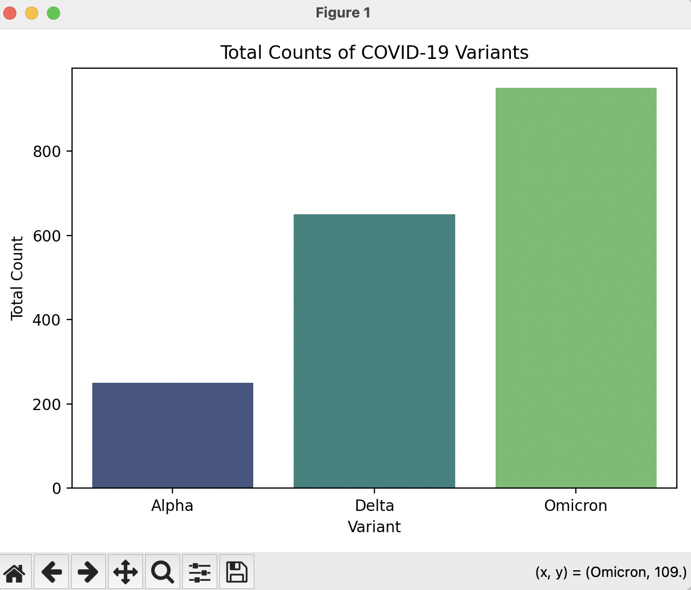

# COVID-19 Variant Analysis

## Overview
This project analyzes COVID-19 variant data using Python.  It demonstrates data wrangling, visualization, and simple and analytics using real or mock variant datasets.

## Skills Demonstrated
- Python scripting
- Data cleaning and manipulation (Pandas)
- Data visualization (Matplotlib, Seaborn, Plotly)
- Basic bioinformatics workflows

## How to Run
1. Clone this repository
2. Set up a virtual environment and install requirements:
 python3 -m venv venv
 source venv/bin/activate
 pip install -r requirements.txt
3. Run the main script:
 python variant_analysis.py

## Example Output

c

## Next Steps
-Load real GISAID or NCBI variant data

-Compare mutation trends across regions

-Add interactive visualization with Plotly or Dash
